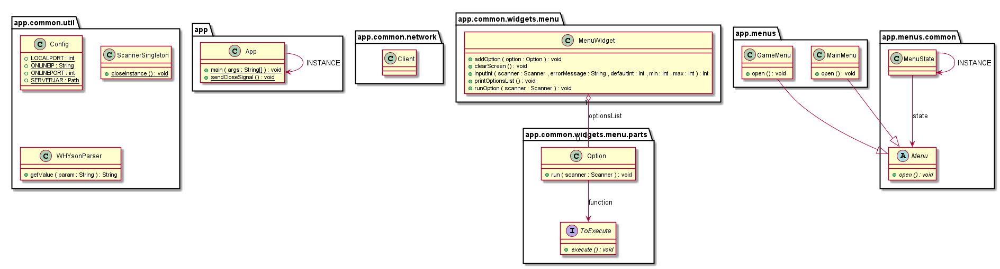

# Class diagram van het project


# Hoe je het Maven-project compileert en uitvoert (deels gegenereerd door ai)

## Vereisten
- Java Development Kit (JDK) geïnstalleerd (versie 11 of hoger) (de game server gebruikt 11)
Check met:
```bash
java -version
```

- Maven geïnstalleerd (https://maven.apache.org/download.cgi)
Check met:
```bash
mvn --version
```

### problemen met instaleren
check of java en maven op de PATH staan
stuur een bericht voor meer help (ik reageer sneller op whatsapp (yuna))

## Stap 1: Project openen
Open een terminal of command prompt en navigeer naar de map waar je project zich bevindt.

```bash
cd pad/naar/je/project/Project-Intelligente-Systemen
```

Je can checken of je in de goede folder met ls:

```bash
ls
```

De output moetde volgende text bevatten:

pom.xml src target

## Stap 2: testen en uitvoeren

### testen

```bash
mvn test
```

### uitvoeren

```bash
mvn compile exec:java
```

## Optioneel: Class diagram genereren
### Vereisten
- Graphviz
Check met:
```bash
dot -V
```

### problemen met instaleren
check of Graphviz op de PATH staan
stuur een bericht voor meer help (ik reageer sneller op whatsapp (yuna))

### uitvoeren

```bash
mvn compile -Puml-generation
```

### note
dit check niet voor errors en doet ook geen tests
